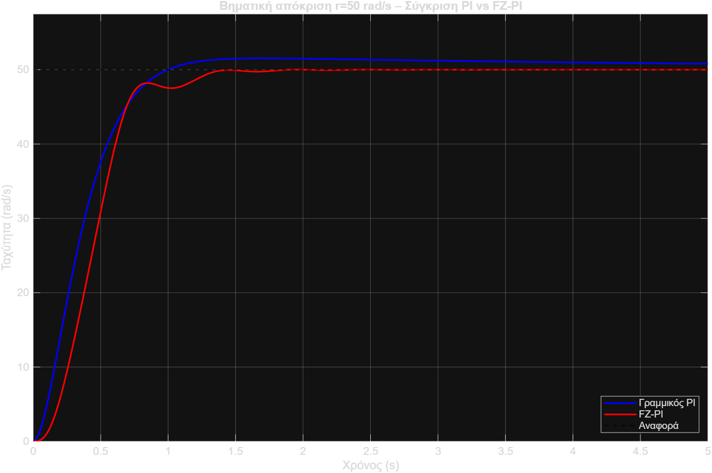

# 1. Fuzzy PI Speed Control of a Work-Table Mechanism

Speed control of a high-precision work table driven by a DC motor, with plant

$$G_p(s) = \frac{25}{(s+0.1)(s+10)}, \qquad \omega_{max} = 50 \text{ rad/s}$$

A classical linear PI controller is designed first (root locus) and then used as the starting point for an incremental fuzzy PI (FZ-PI) controller.

## Approach

- **Linear PI:** zero placed at c = 0.2 via root locus → Kp = 1.0533, Ki = 0.2107 (spec: overshoot < 8%, rise time < 0.6 s).
- **FZ-PI:** inputs E, dE with 7 triangular MFs each, output dU with 9 MFs, 49 antisymmetric rules, incremental structure `u(k) = u(k-1) + K1·ΔuN(k)`. Scaling gains tuned to Ke = 0.04, α = 0.015, K1 = 4.0.
- **Scenario 1:** step response at r = 50 rad/s, PI vs. FZ-PI, rule-activation analysis and 3D control surface.
- **Scenario 2:** tracking a multi-level step profile (20 → 50 → 40 rad/s) and a ramp (0.4 → 50 → 0.4 rad/s).

## Results

| Metric | Linear PI | FZ-PI |
|---|---|---|
| Overshoot (r = 50) | 2.49% | 0.046% |
| Rise time | 0.593 s | 0.504 s |
| Settling time | ~2.1 s | 1.241 s |
| Steady-state error | 0 | 0 |
| Ramp tracking RMS error | – | 0.129 rad/s |

A practical finding: the theoretical α = 0.0001 saturates the controller everywhere (≈95% overshoot) because the error derivative is computed as `[e(k) − e(k−1)] / T`, so α has to be rescaled accordingly.

## How to run

Run the scripts in this order (each one saves the `.mat` file the next one needs):

1. `pi_design_trapezi_ergasias.m` – PI design → `pi_tuned_params.mat`
2. `design_FLC_FZPI.m` – builds the FIS → `FZ_PI_Controller.fis`, `flc_corrected_params.mat`
3. `scenario1_step_response.m` – step response comparison → `scenario1_results.mat`
4. `senario_2.m` – step profile and ramp tracking

## Files

- `assignment.pdf` – assignment brief (Greek)
- `report.pdf` – full report (Greek)
