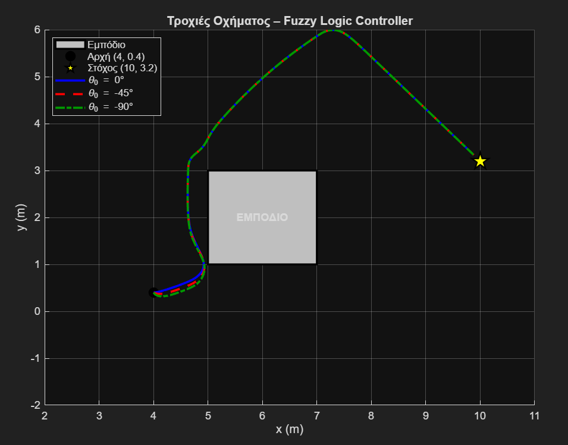
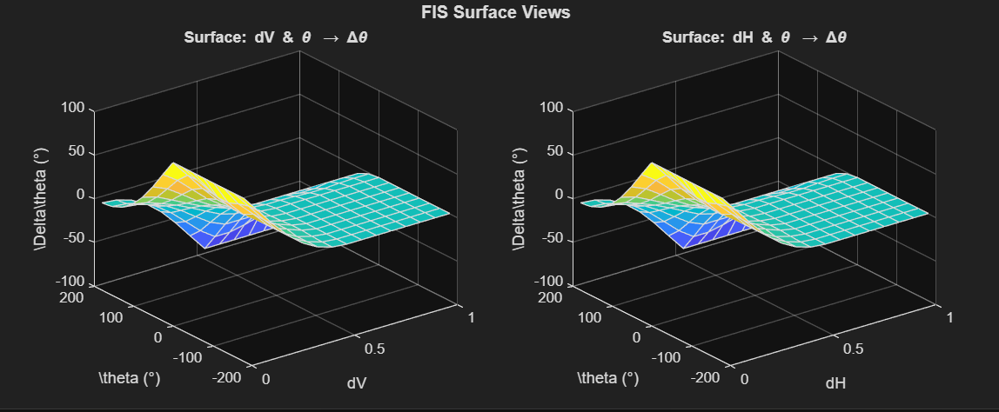

# 2. Fuzzy Car Control with Obstacle Avoidance

A fuzzy logic controller that steers a vehicle moving at constant speed (u = 0.05 m/s) from (4, 0.4) to the goal (10, 3.2) while avoiding a rectangular obstacle at x ∈ [5, 7], y ∈ [1, 3].

## Controller

| Variable | Range | Fuzzy sets |
|---|---|---|
| dV – vertical distance to obstacle | [0, 1] m | S, M, L |
| dH – horizontal distance to obstacle | [0, 1] m | S, M, L |
| θ – heading | [−180°, 180°] | N, ZE, P |
| Δθ – heading change (output) | [−130°, 130°] | N, ZE, P |

- Triangular MFs, 27 rules (3 × 3 × 3)
- Larsen implication, max aggregation, centre-of-area defuzzification
- A goal-seeking term that pulls the vehicle toward the target and switches off near the obstacle

## Results

Simulated for initial headings θ = 0°, −45°, −90°. In all three cases the vehicle avoids the obstacle and stops within 0.20 m of the goal (final error 0.16–0.19 m), needing 222–226 steps.

## How to run

Run `car_flc.m`. It builds the FIS (saved as `car_flc.fis`) and simulates the three trajectories.

## Files

- `assignment.pdf` – assignment brief (Greek)
- `report.pdf` – full report (Greek)
