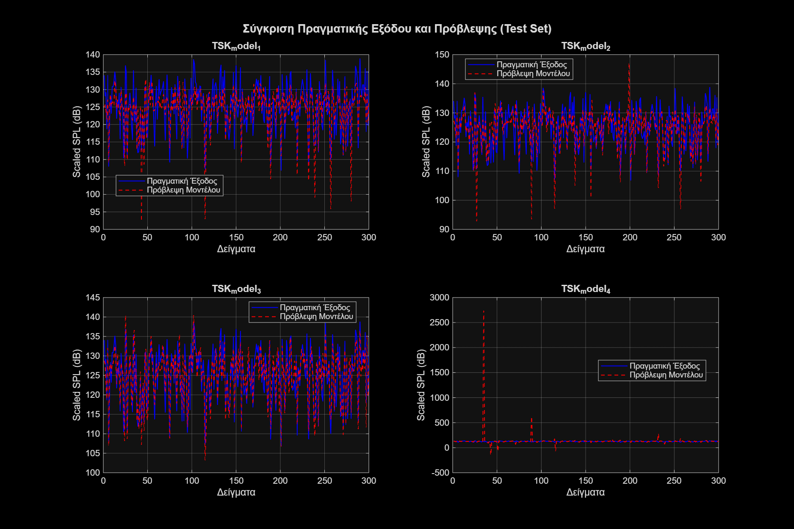
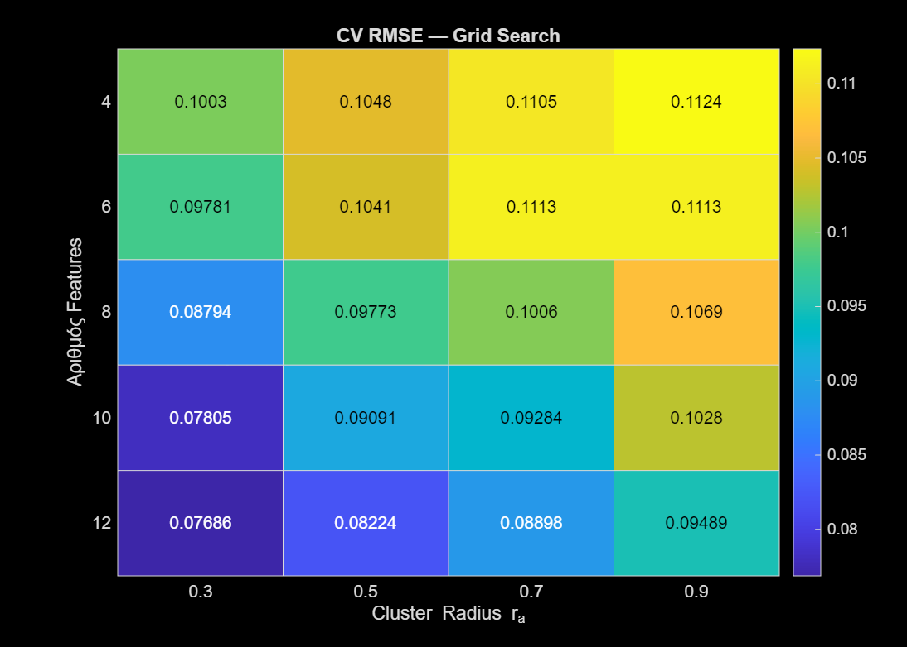
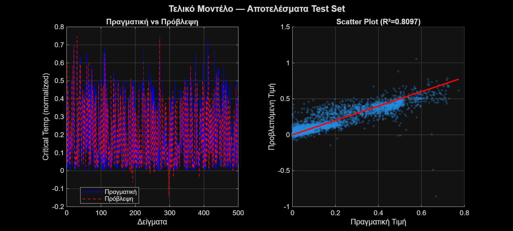

# 3. Regression with TSK Models

Neuro-fuzzy TSK (Takagi–Sugeno–Kang) models for regression, trained with the ANFIS hybrid method (backpropagation for the membership functions, least squares for the consequents), with early stopping on a validation set (60/20/20 split).

## Part 1 – Airfoil Self-Noise (1,503 samples, 5 features)

Four models with grid partitioning and bell-shaped MFs:

| Model | MFs per input | Output | Rules | RMSE (dB) | R² |
|---|---|---|---|---|---|
| TSK_model_1 | 2 | Singleton | 32 | 4.77 | 0.55 |
| TSK_model_2 | 3 | Singleton | 243 | 4.81 | 0.54 |
| **TSK_model_3** | **2** | **Linear** | **32** | **3.48** | **0.76** |
| TSK_model_4 | 3 | Linear | 243 | 155.7 | −479 |

A linear output clearly beats a singleton one. Model 4 overfits badly: it has about as many parameters (1,503) as there are samples in the whole dataset.

## Part 2 – Superconductivity (21,263 samples, 81 features)

- **Feature selection:** ReliefF ranking of the 81 features.
- **Model:** TSK with subtractive clustering (avoids the 2⁸¹ rule explosion of grid partitioning).
- **Hyperparameters:** grid search over number of features {4, 6, 8, 10, 12} × cluster radius rα {0.3, 0.5, 0.7, 0.9}, with 5-fold cross-validation.
- **Best:** 12 features, rα = 0.3 → 16 rules.

| RMSE (normalised) | NMSE | NDEI | R² |
|---|---|---|---|
| 0.080 | 0.190 | 0.436 | 0.81 |

With 16 rules the model reaches R² = 0.81. Grid partitioning on the same 12 inputs would need 4,096 rules with 2 MFs per input, or 531,441 with 3.

## How to run

**Part 1** (`part1/`): `load_and_split.m` → `train_tsk_models.m` → `evaluate_models.m` → `plot_results.m`

**Part 2** (`part2/`): `step1_load_split.m` → `step2_gridsearch.m` → `step3_final_model.m`

The dataset is stored compressed as `train.zip`. `step1_load_split.m` extracts `train.csv` automatically and creates `supercon_split.mat`. Neither of those two files is in the repo because they're large, but running the script regenerates both.

## Files

- `assignment.pdf` – assignment brief (Greek)
- `report.pdf` – full report (Greek)
