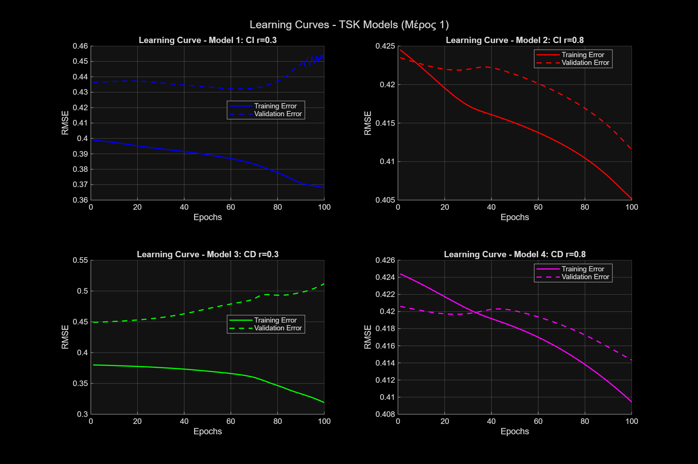
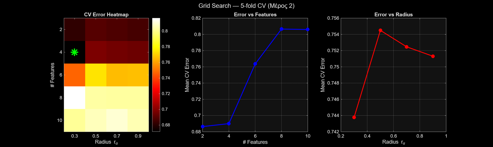
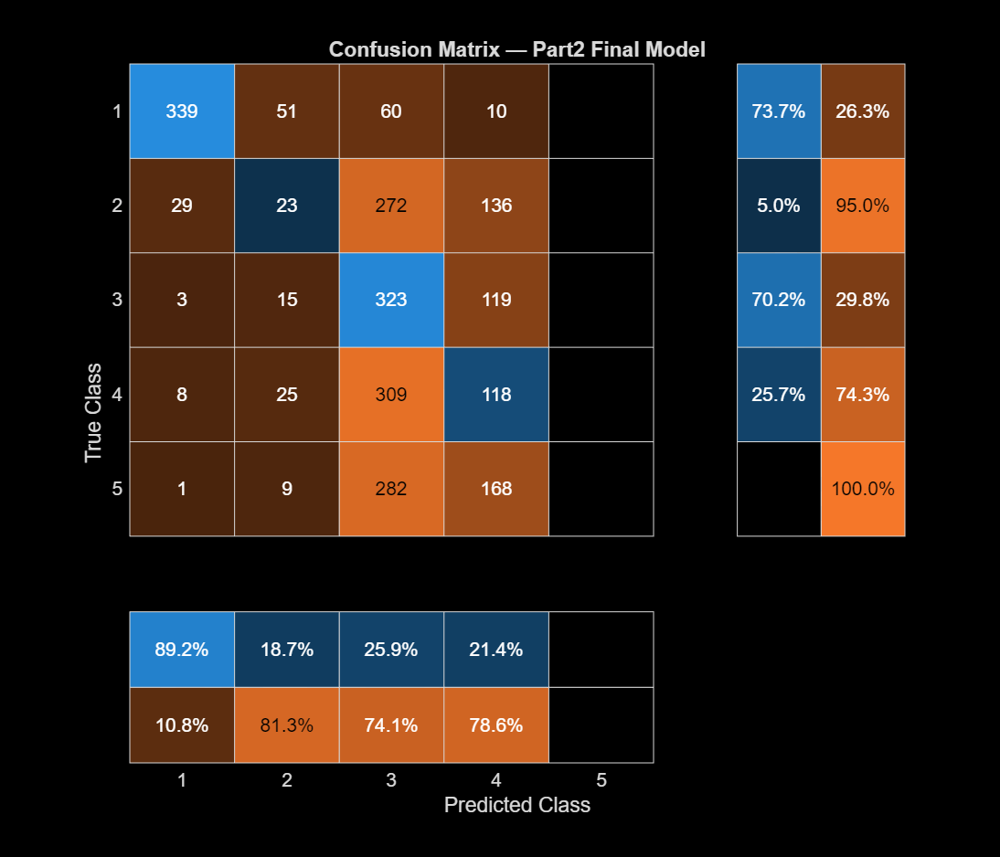

# 4. Classification with TSK Models

TSK neuro-fuzzy classifiers initialised with subtractive clustering (SC), comparing **class-independent** clustering (on the whole training set) with **class-dependent** clustering (run on each class separately). Evaluation uses Overall Accuracy (OA), Producer's/User's Accuracy per class and Cohen's κ.

## Part 1 – Haberman's Survival (306 samples, 3 features, 2 classes)

Stratified 60/20/20 split.

| Model | Rules | OA | κ |
|---|---|---|---|
| Class-independent, r = 0.3 | 16 | 70.5% | 0.171 |
| Class-independent, r = 0.8 | 3 | 70.5% | 0.133 |
| Class-dependent, r = 0.3 | 31 | 60.7% | 0.059 |
| **Class-dependent, r = 0.8** | **4** | **73.8%** | **0.192** |

The smallest model generalises best, while the model with the most rules overfits.

## Part 2 – Epileptic Seizure Recognition (11,500 samples, 178 features, 5 classes)

- Z-score normalisation, using statistics computed on the training set only
- Relief feature ranking (k = 10)
- Grid search over number of features {2, 4, 6, 8, 10} × SC radius {0.3, 0.5, 0.7, 0.9}, with stratified 5-fold cross-validation
- Best: 4 features, rα = 0.3, class-dependent SC → about 5 rules

Overall accuracy is 34.9% (κ = 0.186). Classes 2–5 are very hard to separate using raw EEG time samples. The seizure class itself is detected with **73.7% recall** (producer's accuracy).

## How to run

- **Part 1:** run `part1/part1_main.m`. The helper functions are in the same folder.
- **Part 2:** run `part2/part2_main.m`.

## Files

- `assignment.pdf` – assignment brief (Greek)
- `report.pdf` – full report (Greek)
